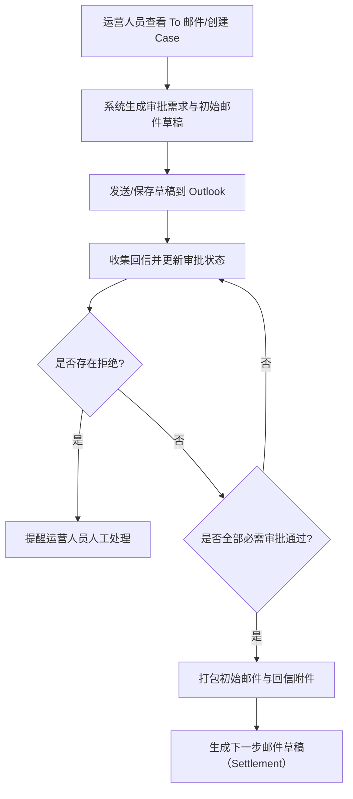

## 1. 产品概述
审批邮件工作台是一个面向内部运营人员的 Web 控制台，用于查看 Outlook 邮件与审批流程 Case 的状态，并维护不同环节的邮件模板与变量填充规则。
- 解决的问题：邮件与审批流程分散在 Outlook 会话中难以追踪、模板分散难以统一管理、审批状态与下一步动作不透明
- 目标价值：让运营人员在一个页面内完成“看邮件 → 追流程 → 管模板 → 准备下一步邮件”的闭环，提高可追溯性与一致性

## 2. 核心功能

### 2.1 用户角色
| 角色 | 登录方式 | 核心权限 |
|------|----------|----------|
| 运营/发起人 | 公司内网账号（后续对接 SSO） | 查看 To/CC 邮件、创建/跟踪 Case、编辑模板、触发刷新/打包 |
| 审批人（只读） | 可选（后续） | 只读查看与自己相关的审批 Case、查看模板渲染后的预览 |

### 2.2 功能模块
1. **工作台总览**：关键指标、待处理列表、最近 Case、异常与提醒
2. **邮件中心**：按 To/CC、会话、状态筛选与检索；关联到 Case
3. **流程 Case**：Case 列表与详情；审批进度、回信汇总、下一步草稿与附件包
4. **模板管理**：每个环节的模板编辑、变量预览、版本保存与回滚（基础）

### 2.3 页面详情
| 页面名称 | 模块名称 | 功能描述 |
|----------|----------|----------|
| 工作台总览 | 待处理 | 展示需要我处理的 To 邮件与待跟进 Case，支持一键进入详情 |
| 工作台总览 | 抄送概览 | 展示抄送给我的邮件摘要，不进入待处理队列，可快速标记已读/忽略 |
| 邮件中心 | To/CC 筛选与会话列表 | 支持按 To/CC、关键字、时间、发件人、主题、会话线程过滤与搜索 |
| 邮件中心 | 邮件详情 | 展示正文、附件列表、会话上下文，支持“创建/关联 Case” |
| Case 列表 | 筛选与排序 | 按客户 ID、金额区间、交易类型、审批状态、更新时间筛选 |
| Case 详情 | 审批进度 | 展示应审批角色列表、已回信动作、时间线与是否全部批准 |
| Case 详情 | 邮件草稿 | 展示初始审批邮件草稿与下一步邮件草稿（如已生成），支持复制内容 |
| Case 详情 | 附件包 | 展示打包的附件文件清单与下载入口（初期为本地文件链接/占位） |
| 模板管理 | 环节选择 | 初始审批邮件、提醒、下一步邮件等模板入口与说明 |
| 模板管理 | 编辑与预览 | 支持模板正文编辑、变量插入、选择样例交易做渲染预览并保存 |

## 3. 核心流程
主要用户流程：
1) 运营人员在邮件中心看到 To 邮件或手动发起一个新的审批 Case  
2) 系统按客户 ID、账户类型、交易类型与金额规则生成所需审批人清单并生成审批邮件草稿  
3) 系统从 Outlook 会话/线程收集回信动作并更新审批状态；若有拒绝则提醒运营人员处理  
4) 当全部必需审批通过后，系统打包初始邮件与全部回信作为附件并生成下一步邮件草稿（发给 Settlement 或相关操作团队）

## 4. 用户界面设计
### 4.1 设计风格
- 视觉方向：金融运营控制台 + 账簿质感（深色底、细网格、清晰层级、少量高对比强调色）
- 主色：深墨蓝/石墨黑；辅色：雾白/浅灰；强调色：琥珀黄或青绿用于“待处理/通过/风险”
- 按钮：轻微圆角，重点操作使用高对比强调色；危险操作使用红色强调
- 字体：标题用衬线中文（强调“账簿/审计”气质），正文用无衬线中文以保证可读性
- 布局：顶部导航 + 左侧二级导航；主区使用卡片与时间线组件组合
- 图标：线性图标风格，配合少量状态徽标（Approved/Rejected/Pending）

### 4.2 页面设计概览
| 页面名称 | 模块名称 | UI 元素 |
|----------|----------|----------|
| 工作台总览 | 待处理列表 | 强状态标签、快捷筛选、列表密度可切换、悬停展示摘要 |
| 邮件中心 | 会话列表 | To/CC 维度切换、会话折叠、未读强调、快速操作区 |
| Case 详情 | 审批时间线 | 角色徽标、状态颜色、时间戳、原文摘录可展开 |
| 模板管理 | 编辑与预览 | 左侧编辑器、右侧渲染预览、变量面板、版本历史抽屉 |

### 4.3 响应式
桌面优先；移动端仅提供只读浏览与轻量筛选，编辑模板与 Case 细节以桌面为主。
