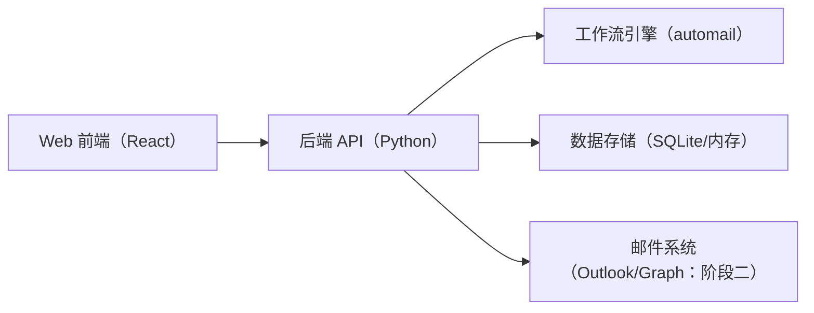
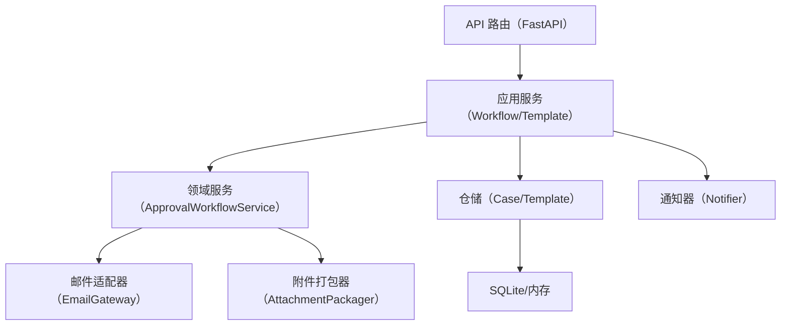
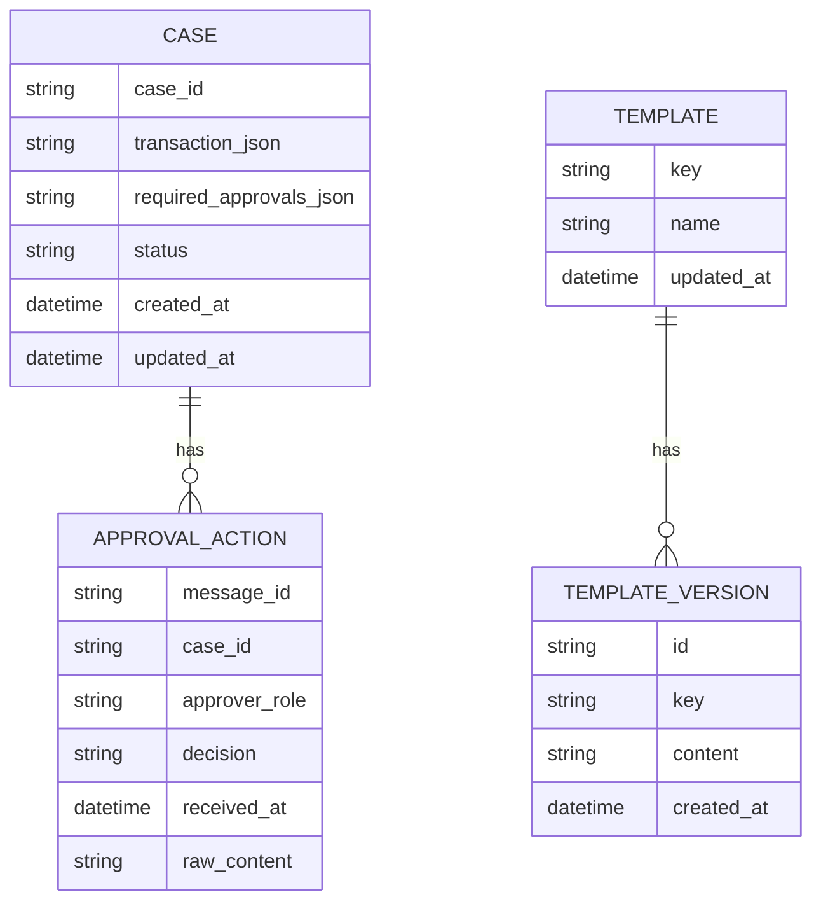

## 1. 架构设计


## 2. 技术选型说明
- 前端：React@18 + Vite + Tailwind CSS
- 初始化工具：Vite
- 后端：FastAPI（与现有 automail Python 代码同语言，便于复用工作流服务与规则引擎）
- 数据存储：初期 SQLite（或纯内存），用于保存 Case、模板版本与邮件索引；后续可切换 Postgres
- 邮件集成：初期使用适配器 Stub/Mock；阶段二对接 Windows Outlook COM 或 Microsoft Graph

## 3. 路由定义
| 路由 | 用途 |
|------|------|
| / | 工作台总览 |
| /mail | 邮件中心（To/CC、会话列表、邮件详情） |
| /cases | Case 列表 |
| /cases/:id | Case 详情（审批进度、草稿、附件包） |
| /templates | 模板管理（编辑、预览、版本） |

## 4. API 定义
### 4.1 核心类型（TypeScript）
```ts
export type ApprovalDecision = "pending" | "approved" | "rejected";

export type TransactionType = "withdrawal" | "deposit";
export type AccountCategory = "personal_or_joint" | "corporate_or_other";
export type AssetInstructionType = "cash" | "si_fop_dvp";

export interface TransactionRequest {
  clientName: string;
  accountNo: string;
  transactionType: TransactionType;
  accountCategory: AccountCategory;
  amountHkd: number;
  currency: string;
  instructionType: AssetInstructionType;
  marketValueHkd?: number;
  settlementAmountHkd?: number;
  hasDebitCashOrStockBeforeOrAfter: boolean;
  isMarginAccountWithDebitBalance: boolean;
  beneficiaryName?: string;
  requestedBy?: string;
  purpose?: string;
  extraContext?: Record<string, unknown>;
}

export interface ApprovalRequirement {
  roleCode: string;
  displayName: string;
  reason: string;
  mandatory: boolean;
}

export interface ApprovalAction {
  approverRole: string;
  approverName: string;
  approverEmail: string;
  decision: ApprovalDecision;
  receivedAt: string;
  messageId: string;
  comment?: string;
  rawContent?: string;
}

export interface WorkflowCase {
  caseId: string;
  transaction: TransactionRequest;
  requiredApprovals: ApprovalRequirement[];
  approvalActions: ApprovalAction[];
  initialEmailSubject: string;
  nextStepEmailSubject?: string;
  createdAt: string;
  updatedAt: string;
}
```

### 4.2 接口列表（REST）
| 方法 | 路径 | 说明 |
|------|------|------|
| GET | /api/health | 健康检查 |
| GET | /api/cases | Case 列表（支持筛选：客户、金额区间、状态） |
| POST | /api/cases | 创建 Case（传入交易请求与 approver 目录） |
| GET | /api/cases/:id | Case 详情 |
| POST | /api/cases/:id/refresh | 拉取回信并刷新审批状态（对接邮件适配器） |
| POST | /api/cases/:id/actions | 手工补录审批动作 |
| GET | /api/templates | 模板列表 |
| GET | /api/templates/:key | 读取模板与版本 |
| PUT | /api/templates/:key | 保存新版本模板 |
| POST | /api/templates/:key/preview | 传入样例交易请求，返回渲染预览 |
| GET | /api/mail | 邮件索引列表（To/CC、会话聚合：阶段二） |
| GET | /api/mail/:id | 邮件详情（阶段二） |

## 5. 服务端架构图


## 6. 数据模型
### 6.1 ER 图（简化）


### 6.2 DDL（初期）
```sql
CREATE TABLE IF NOT EXISTS cases (
  case_id TEXT PRIMARY KEY,
  transaction_json TEXT NOT NULL,
  required_approvals_json TEXT NOT NULL,
  status TEXT NOT NULL,
  created_at TEXT NOT NULL,
  updated_at TEXT NOT NULL
);

CREATE TABLE IF NOT EXISTS approval_actions (
  message_id TEXT PRIMARY KEY,
  case_id TEXT NOT NULL,
  approver_role TEXT NOT NULL,
  decision TEXT NOT NULL,
  received_at TEXT NOT NULL,
  approver_name TEXT,
  approver_email TEXT,
  comment TEXT,
  raw_content TEXT,
  FOREIGN KEY(case_id) REFERENCES cases(case_id)
);

CREATE TABLE IF NOT EXISTS templates (
  key TEXT PRIMARY KEY,
  name TEXT NOT NULL,
  updated_at TEXT NOT NULL
);

CREATE TABLE IF NOT EXISTS template_versions (
  id TEXT PRIMARY KEY,
  key TEXT NOT NULL,
  content TEXT NOT NULL,
  created_at TEXT NOT NULL,
  FOREIGN KEY(key) REFERENCES templates(key)
);
CREATE INDEX IF NOT EXISTS idx_template_versions_key_created_at ON template_versions(key, created_at DESC);
```
